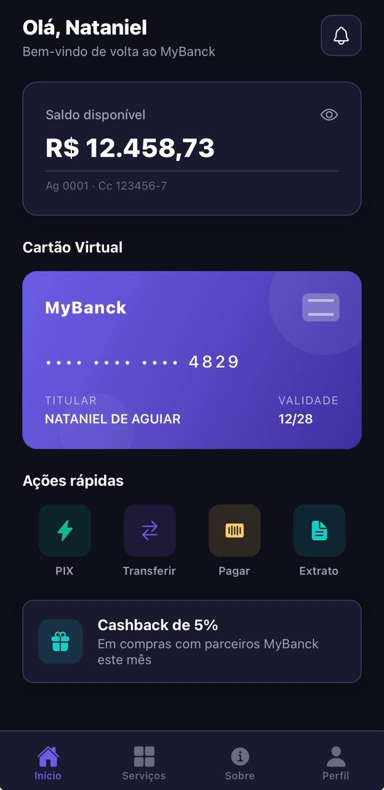
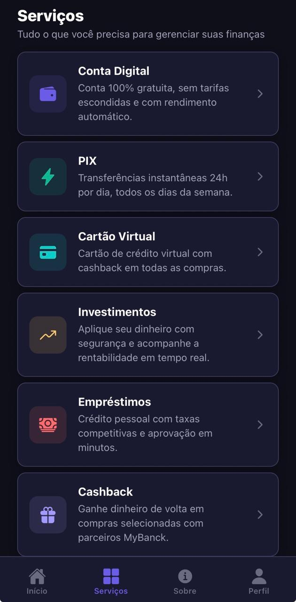
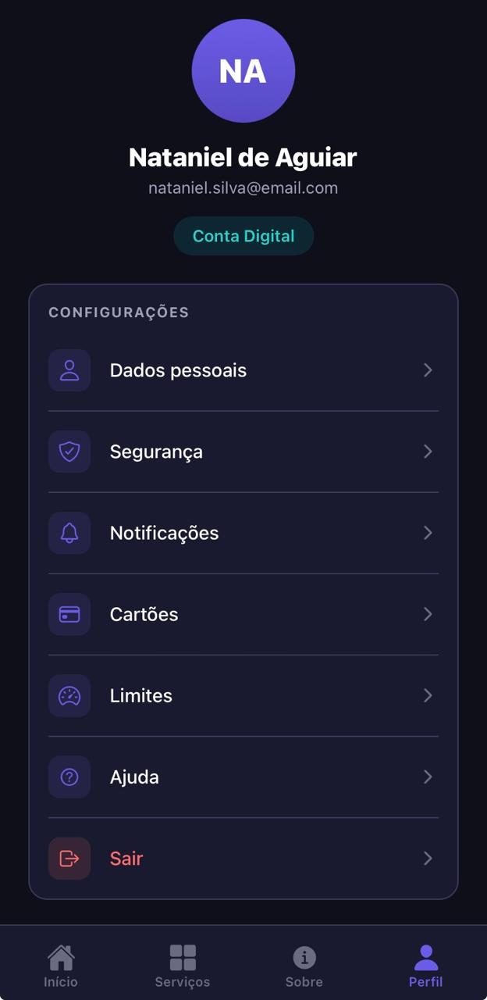

# MyBanck

Aplicativo mobile de fintech/banco digital desenvolvido com **React Native** e **Expo**, como projeto avaliativo da disciplina de Programação para Dispositivos Móveis.

## Sobre o projeto

O **MyBanck** é um banco digital fictício com interface moderna, focada em credibilidade, segurança e facilidade de uso. Todos os dados são simulados (mockados) — não há backend ou integração com banco de dados.

**Slogan:** Seu banco digital, do seu jeito.

## Telas

| Tela | Descrição |
|------|-----------|
| **Boas-vindas** | Logo, nome, slogan e botão de acesso |
| **Home** | Saudação, saldo, cartão virtual e ações rápidas (PIX, Transferir, Pagar, Extrato) |
| **Serviços** | Conta Digital, PIX, Cartão Virtual, Investimentos, Empréstimos e Cashback |
| **Sobre** | História, missão, visão, valores e diferenciais da fintech |
| **Perfil** | Dados fictícios do usuário e configurações simuladas |

### Preview

| Boas-vindas | Home | Serviços |
|:---:|:---:|:---:|
|  |  |  |

| Sobre | Perfil |
|:---:|:---:|
|  |  |

## Tecnologias

- [React Native](https://reactnative.dev/)
- [Expo SDK 54](https://docs.expo.dev/)
- [React Navigation](https://reactnavigation.org/) (Stack + Bottom Tabs)
- [TypeScript](https://www.typescriptlang.org/)
- [Expo Linear Gradient](https://docs.expo.dev/versions/latest/sdk/linear-gradient/)

## Estrutura do projeto

```
mybanck/
├── App.tsx                 # Componente raiz
├── src/
│   ├── components/         # Componentes reutilizáveis
│   ├── constants/          # Tema, cores e dados mockados
│   ├── navigation/         # Configuração de rotas
│   └── screens/            # Telas do aplicativo
├── assets/                 # Ícones e imagens
└── README.md
```

## Como executar

### Pré-requisitos

- [Node.js](https://nodejs.org/) (v18 ou superior)
- [Expo Go](https://expo.dev/go) instalado no celular (Android ou iOS)

### Instalação

```bash
# Clone o repositório
git clone <https://github.com/Waldemiro20/mybanck.git>
cd mybanck

# Instale as dependências
npm install
```

### Executar o app

```bash
# Iniciar o servidor de desenvolvimento
npm start

# Ou com acesso na rede local (recomendado para testar no celular)
npx expo start --lan
```

Escaneie o QR Code com o **Expo Go** (Android) ou a câmera (iOS).

> **Dica:** Se `--tunnel` falhar com erro de ngrok, use `--lan` com o celular na mesma rede Wi-Fi.

### Outras opções

```bash
npm run android   # Emulador Android
npm run ios       # Simulador iOS (macOS)
npm run web       # Navegador web
```

## Identidade visual

| Elemento | Cor |
|----------|-----|
| Primária | `#6C5CE7` (Roxo) |
| Secundária | `#00CEC9` (Teal) |
| Destaque | `#00B894` (Verde) |
| Fundo | `#0F0F1A` (Escuro) |

## Autores

- **Carlos Waldemiro** - **Pedro Lima** - **Devide Lucas** - **Matheus Fernandes**


Disciplina: Programação para Dispositivos Móveis

## Licença

Projeto acadêmico — uso livre para fins educacionais.
